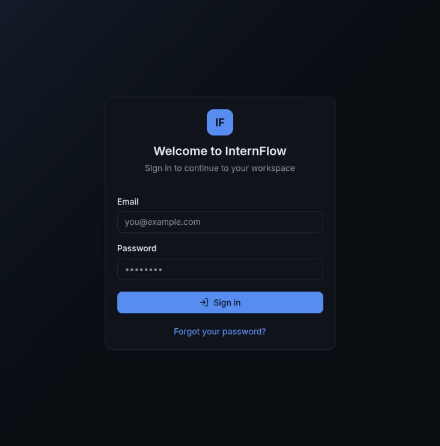

# InternFlow

> A full-stack operations hub for running internships—from onboarding and task
> delivery to attendance, reviews, reporting, and completion certificates.

## Product preview



Full-stack internship operations platform: batch management, task assignment,
submissions and reviews, attendance tracking, leave requests, calendar,
notifications (REST + WebSocket), analytics, reports, certificates and outcome
processing.

## Stack

- **Frontend** — React 19 + Vite + TypeScript, React Router 7, TanStack Query,
  Tailwind CSS v4 (shadcn-style components), sonner, recharts, lucide-react.
- **Backend** — FastAPI + SQLAlchemy 2 + Alembic, PyJWT access/refresh tokens
  with Argon2 password hashing, PDF reports (reportlab, Noto fonts).
- **Database** — PostgreSQL (psycopg 3), migrations via Alembic.
- **Realtime** — authenticated WebSocket hub at `/ws`.

## Project layout

```
backend/           FastAPI application (app/, alembic/, scripts/)
frontend/          React + Vite application (src/)
docker/            Container images for api and web
docker-compose.yml Compose dev environment (db + api + web)
requirements.txt   Legacy/root requirements (see backend/requirements.txt)
storage/           Local upload + generated-report storage (git-ignored)
database/          Backups landing area
```

> `backend/requirements.txt` is the source of truth for Python dependencies;
> the stale root `requirements.txt` is kept for reference only.

## Demo accounts

The dev seed creates 6 accounts, all with password `Demo1234!`:

| Role       | Email                           |
| ---------- | ------------------------------- |
| Admin      | `admin@internflow.dev`          |
| Supervisor | `supervisor@internflow.dev`     |
| Intern x4  | `intern1..4@internflow.dev`     |

First-time flows (set-password / forgot + reset) are wired to email; in
development, emails are logged to the server console.

## What teams can do

- Organize internship batches, supervisors, interns, and company settings.
- Assign work, collect submissions and attachments, and complete reviews.
- Track attendance, leave, calendar events, announcements, and notifications.
- Give each role a focused dashboard with live updates and scoped access.
- Produce operational reports, certificates, and completion records.

## Running locally

### 1. Database

PostgreSQL 16+ on `localhost:5432`. Create role and database:

```bash
sudo -u postgres psql -c "CREATE ROLE internflow LOGIN PASSWORD 'internflow_dev' \
  SUPERUSER CREATEDB CREATEROLE;"
sudo -u postgres psql -c "CREATE DATABASE internflow OWNER internflow;"
```

Defaults resolve from `backend/.env` (see `.env.example`).

### 2. Backend

```bash
cd backend
python -m venv .venv
. .venv/bin/activate
pip install -r requirements.txt
cp ../.env.example ../.env        # adjust as needed
alembic upgrade head              # apply schema
python -m app.db.seed             # idempotent dev seed
uvicorn app.main:app --port 8000  # API + /ws
```

Verification: `curl localhost:8000/api/v1/health`.

End-to-end smoke suite (resets + reseeds the database, 36 checks):

```bash
cd backend
.venv/bin/python scripts/smoke_test.py
```

Unit/API regression tests:

```bash
cd backend
.venv/bin/python -m pytest tests/
.venv/bin/python -m ruff check app/ tests/
```

### 3. Frontend

```bash
cd frontend
npm install
npm run dev                       # http://localhost:5173
```

The dev server proxies `/api` and `/ws` to `http://localhost:8000`.
Production build: `npm run build` (typecheck via `tsc -b`).

## Docker

```bash
cp .env.example .env
docker compose up --build
```

- `db`    : PostgreSQL 16 (port 5432)
- `api`   : waits for DB → migrations → seed check → uvicorn (port 8000)
- `web`   : built frontend served on port 5173

## API overview

All endpoints live under `/api/v1` (OpenAPI docs at `/docs`):

- `auth` — login, refresh, logout, first-password, forgot/reset
- `users` — directory, profile, avatar, bulk deactivate, CSV import
- `batches` — CRUD, archive, intern enrollment (single + bulk)
- `tasks` — assign, submit, extensions, attachments, comments, reviews
- `submissions` — JSON + multipart file upload, review workflow
- `attendance` — check-in/out, daily log, records, summary, remarks
- `leave` — request + (admin) decide
- `calendar` — task/event/leave feed
- `announcements` / `events` — batch communications
- `notifications` — list, mark read, preferences, push subscriptions, VAPID
- `search` — global intern/task/batch search
- `analytics` — intern / supervisor / admin(HR) dashboards
- `reports` / `certificates` / `completions` — admin exports and paperwork
- `audit` — admin access log

## Notes

- Interns may only see themselves in listings; supervisors are scoped to their
  batches; company settings, reports and audit are admin-only.
- Leave decisions are currently admin-only at the API layer.
- JWT default dev secret is short — set a 32+ byte `JWT_SECRET_KEY` before any
  non-trivial deployment (see `.env.example`).
